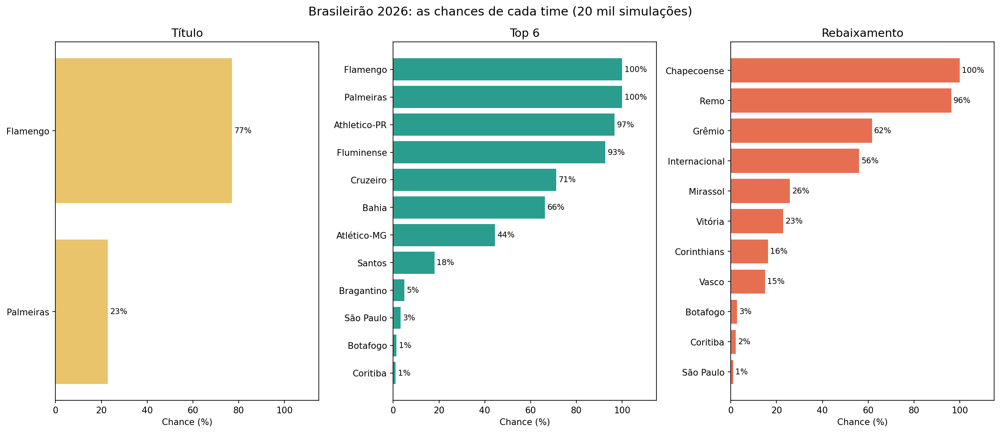
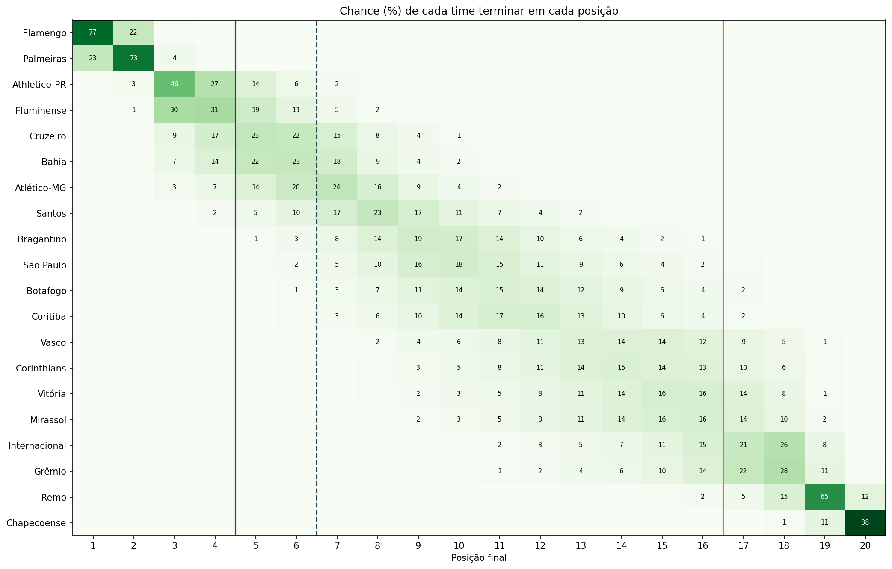
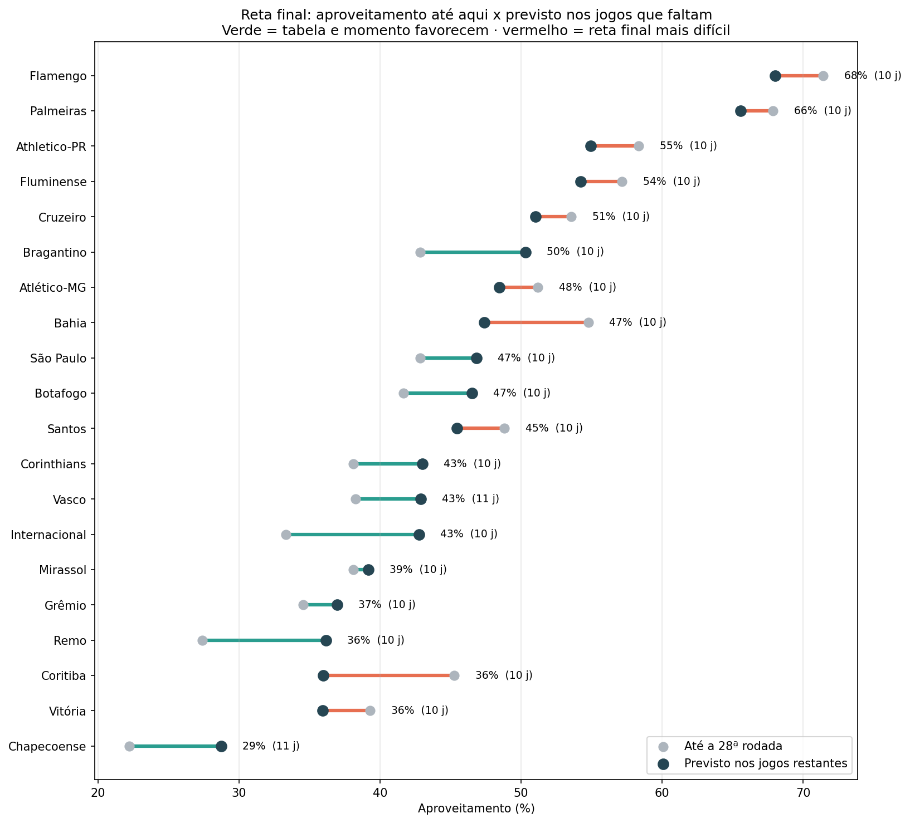
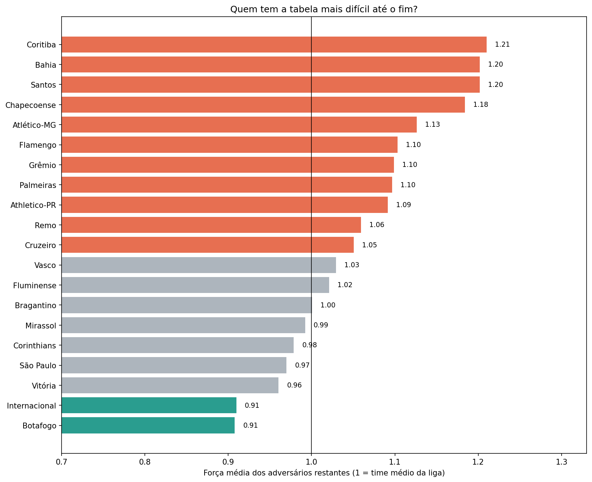
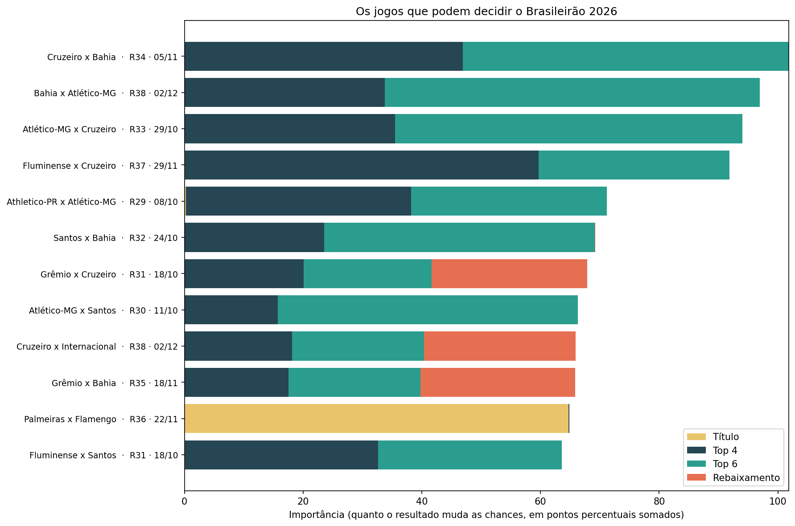

# Previsão do Brasileirão 2026

Quem vai ser campeão? Quem cai? Este projeto estima a força de cada time a partir dos jogos já disputados e **simula os jogos restantes 20 mil vezes** (método de Monte Carlo) para calcular a chance de cada clube terminar campeão, no top 4, no top 6 ou no rebaixamento. Também mostra a reta final de cada time, os jogos mais decisivos e o peso do calendário das copas.

> Previsão feita após a **28ª rodada** (04/10/2026), com 279 jogos disputados e 101 restantes. A base foi conferida: somando jogos realizados e restantes, cada time enfrenta cada um dos outros exatamente duas vezes, uma em casa e uma fora.
>
> Outros projetos: [Dinheiro e Desempenho no Brasileirão 2026](https://github.com/enriquefroes/futebol-dinheiro-e-desempenho) · [O peso do treinador no Brasileirão 2026](https://github.com/enriquefroes/treinadores-brasileirao-2026) · [Reforços e saídas de Atlético-MG e Cruzeiro](https://github.com/enriquefroes/reforcos-galo-cruzeiro-2026) · [O Atlético na Arena MRV](https://github.com/enriquefroes/atletico-arena-mrv)

---

## Perguntas

| Notebook | Pergunta |
|---|---|
| `01_forca_dos_times` | Qual a força de ataque e de defesa de cada time? |
| `02_simulacao` | Qual a chance de cada time ser campeão, ir ao top 6 ou cair? E se o calendário das copas pesar? |
| `03_reta_final` | Quem tem a tabela mais difícil? Quanto cada time deve render, e quanto precisa render, nos jogos que faltam? |
| `04_jogos_decisivos` | Quais jogos podem decidir o campeonato? |

---

## Principais resultados

### 1. As chances de cada time



| Time | Pontos hoje | Pontos previstos | Título | Top 4 | Top 6 | Rebaixamento |
|---|---|---|---|---|---|---|
| Flamengo | 60 | 80 | **77%** | 100% | 100% | — |
| Palmeiras | 57 | 77 | **23%** | 100% | 100% | — |
| Athletico-PR | 49 | 66 | <1% | 77% | 97% | — |
| Fluminense | 48 | 64 | <1% | 63% | 93% | — |
| Cruzeiro | 45 | 60 | — | 26% | 72% | — |
| Bahia | 46 | 60 | — | 21% | 67% | — |
| Atlético-MG | 43 | 58 | — | 10% | 44% | — |
| Santos | 41 | 55 | — | 3% | 18% | — |
| Bragantino | 36 | 51 | — | <1% | 5% | <1% |
| São Paulo | 36 | 50 | — | <1% | 3% | 1% |
| Botafogo | 35 | 49 | — | — | 1% | 3% |
| Coritiba | 38 | 49 | — | <1% | 1% | 2% |
| Vasco | 31 | 45 | — | — | <1% | 15% |
| Corinthians | 32 | 45 | — | — | <1% | 16% |
| Vitória | 33 | 44 | — | — | — | 23% |
| Mirassol | 32 | 44 | — | — | — | 26% |
| Internacional | 28 | 41 | — | — | — | **56%** |
| Grêmio | 29 | 40 | — | — | — | **62%** |
| Remo | 23 | 34 | — | — | — | **96%** |
| Chapecoense | 18 | 28 | — | — | — | **~100%** |

O título é uma briga de dois, com o Flamengo favorito. Remo e Chapecoense estão praticamente rebaixados; as outras duas vagas do Z4 envolvem seis times, com **Grêmio e Internacional** como os mais ameaçados.



### 2. As linhas de corte

Nas simulações, o **6º colocado termina com cerca de 59 pontos**, e o **17º (primeiro do Z4) com cerca de 40**. Ou seja, 41 pontos tendem a bastar para escapar do rebaixamento.

### 3. A reta final de cada time



| Time | Aproveitamento até agora | Previsto na reta final | Destaque |
|---|---|---|---|
| Bragantino | 43% | 50% | A maior melhora prevista |
| Internacional | 33% | 43% | Uma das tabelas mais leves |
| Coritiba | 45% | 36% | A maior queda: a tabela mais difícil |
| Bahia | 55% | 47% | Reta final contra Flamengo, Palmeiras e rivais diretos |



### 4. Os jogos que podem decidir o campeonato



| Briga | Jogo | Rodada |
|---|---|---|
| Título | **Palmeiras x Flamengo** | 36ª (22/11) |
| Top 6 | Bahia x Atlético-MG | 38ª (02/12) |
| Top 6 | Atlético-MG x Cruzeiro | 33ª (29/10) |
| Top 6 | Cruzeiro x Bahia | 34ª (05/11) |
| Rebaixamento | **Grêmio x Internacional** | 30ª (11/10) |
| Rebaixamento | Mirassol x Internacional | 31ª (16/10) |

O resultado de Palmeiras x Flamengo muda as chances de título dos dois em 65 pontos percentuais somados: é, de longe, o jogo do campeonato.

### 5. O peso do calendário

Seis clubes ainda disputam semifinais de copas: Flamengo, Palmeiras e Fluminense na Libertadores; Atlético-MG e Vasco na Sul-Americana; Atlético-MG, Palmeiras, Vasco e Grêmio na Copa do Brasil. No cenário em que quem joga copa a até 3 dias de um jogo do Brasileirão rende 10% menos nesse jogo:

| Time | Jogos colados a copas | Sem desgaste | Com desgaste |
|---|---|---|---|
| Atlético-MG | 5 | 44% de top 6 | **36%** de top 6 |
| Vasco | 4 | 15% de rebaixamento | **18%** de rebaixamento |
| Grêmio | 3 | 62% de rebaixamento | 63% de rebaixamento |

O Galo é o time mais afetado pelo calendário.

---

## Metodologia

### Força dos times (modelo de Poisson)

Os gols de cada time em cada jogo seguem uma distribuição de Poisson, com média:

```
gols esperados do mandante  = média da liga × vantagem de mando × ataque do mandante × defesa do visitante
gols esperados do visitante = média da liga × ataque do visitante × defesa do mandante
```

- Ataque e defesa de cada time são estimados com todos os jogos do campeonato, por regressão de Poisson.
- **Jogos recentes pesam mais:** o peso de um jogo cai pela metade a cada 180 dias, para refletir trocas de treinador e de elenco.
- Uma leve **regularização** evita que poucos placares extremos distorçam a força de um time.
- **Vantagem de mando** estimada: o mandante marca, em média, 1,31 vez os gols que marcaria fora.

### Simulação (Monte Carlo)

1. Para cada um dos 101 jogos restantes, o placar é sorteado a partir dos gols esperados dos dois times.
2. Monta-se a tabela final, com os critérios de desempate: pontos, vitórias, saldo de gols, gols marcados e, por fim, sorteio.
3. O processo é repetido 20 mil vezes. A chance de um evento (título, top 6, rebaixamento) é a porcentagem de simulações em que ele aconteceu.

### Importância dos jogos

Para cada jogo, comparam-se as simulações em que o mandante venceu, empatou ou perdeu. A importância é o quanto o resultado muda as chances de título, top 4, top 6 e rebaixamento **dos dois times em campo**, somadas em pontos percentuais.

### Reta final

- **Dificuldade da tabela:** força média (ataque ÷ defesa) dos adversários restantes.
- **Aproveitamento previsto:** pontos esperados nos jogos restantes, calculados a partir dos gols esperados de cada jogo.
- **Aproveitamento necessário:** quanto cada time precisa fazer nos jogos restantes para passar a linha do top 6 ou do Z4.

---

## Limitações

- **O modelo só enxerga placares.** Não considera lesões, suspensões, trocas de treinador futuras nem a motivação de cada time (quem já está garantido ou rebaixado tende a render menos).
- **Força estável até o fim.** A força de cada time é a de hoje; o modelo não prevê melhoras ou quedas de forma.
- **Desgaste das copas é um cenário, não uma medida.** O ajuste de 10% é uma suposição para testar sensibilidade. As finais das copas não entram, porque ainda não se sabe quem vai disputá-las.
- **Jogo sem data.** Chapecoense x Vasco, da 21ª rodada, ainda não tem data, mas é simulado para a tabela fechar.
- **Vagas continentais variam.** O número de vagas para a Libertadores depende dos campeões das copas; por isso usamos top 4 e top 6 como referências.
- **Previsões são probabilidades.** Um time com 20% de chance não "deve perder": em 1 de cada 5 cenários, o evento acontece.

---

## Como rodar

1. Abra o [Google Colab](https://colab.research.google.com) e faça upload de `notebooks/00_dados.ipynb`.
2. Rode todas as células e autorize o acesso ao Google Drive. O notebook cria a pasta `MeuDrive/analise_previsao_brasileirao/` com as bases.
3. Rode os notebooks 01 a 04, nessa ordem. O 01 calcula a força dos times; o 02 roda as simulações e as salva; o 03 e o 04 usam essas simulações.

**Para atualizar a cada rodada:** mova os jogos disputados de `dados/jogos_restantes.csv` para `dados/partidas_realizadas.csv`, com o placar, ajuste `DATA_REFERENCIA` no notebook 01 e rode tudo de novo.

## Estrutura

```
├── notebooks/   00_dados + 4 análises
├── dados/       partidas_realizadas.csv, jogos_restantes.csv, calendario_copas.csv
├── graficos/    PNGs gerados pelos notebooks
└── tabelas/     CSVs com os resultados de cada análise
```


---

**Autor:** Enrique Froes Nepomuceno · [LinkedIn](https://www.linkedin.com/in/enrique-froes-nepomuceno) · Projeto de estudo em análise de futebol.
